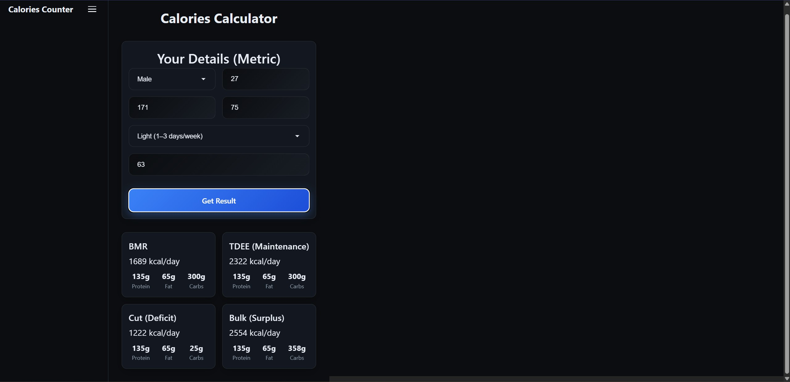

# Calories Counter & Workout Planner (React)



A modern, responsive calorie calculator and workout planner built with React that helps you determine your BMR, TDEE, calorie goals, and provides personalized workout routines.

## Features

- **Complete Calorie Analysis**: Calculate BMR, TDEE, and goals (cutting/bulking/maintenance) in one view
- **Smart Workout Plans**: Get personalized workout routines based on your goals:
  - **Upper/Lower Split**: 4-day routine, great for beginners and cutting
  - **Push/Pull/Legs (PPL)**: 6-day routine, advanced, ideal for bulking
- **Goal-Based Recommendations**: App automatically suggests the best workout split based on your target weight
- **Macro Breakdown**: View protein, fat, and carbohydrate recommendations
- **Dark Theme**: Modern, easy-on-the-eyes interface
- **Responsive Design**: Works seamlessly on desktop and mobile devices
- **Client-Side Only**: All calculations happen in your browser - no data sent to servers

## Tech Stack

- React 19
- React Router DOM for navigation
- CSS3 with CSS Grid and Flexbox
- Vite for development and building

## Getting Started

### Prerequisites

- Node.js (version 16 or higher)
- npm

### Installation

1. Clone the repository or navigate to the project directory
2. Install dependencies:
   ```bash
   npm install
   ```

3. Start the development server:
   ```bash
   npm run dev
   ```

4. Open your browser and navigate to `http://localhost:5173`

### Building for Production

```bash
npm run build
```

The built files will be in the `dist` directory.

## How to Use

1. **Overview Page**: Enter all your details including target weight for complete calorie analysis (BMR, TDEE, cutting/bulking goals)
2. **Workout Plan Page**: Get personalized workout routines based on your fitness goals

### Input Fields

- **Sex**: Male or Female (affects BMR calculation)
- **Age**: Your age in years
- **Height**: Your height in centimeters
- **Weight**: Your current weight in kilograms
- **Activity Level**: Choose from:
  - Sedentary (little to no exercise)
  - Light (1-3 days/week)
  - Moderate (3-5 days/week)
  - Active (6-7 days/week)
  - Athlete (2x/day training)
- **Target Weight**: Your goal weight (for goals calculation)

## Calculations & Recommendations

- **BMR**: Uses the Mifflin-St Jeor equation (metric units)
- **TDEE**: BMR multiplied by activity factor
- **Goals**: 
  - Cutting: 20% deficit or calculated based on target weight
  - Bulking: 10% surplus or calculated based on target weight
  - Macros: 1.8g protein per kg body weight, 25% calories from fat, remainder from carbs
- **Workout Recommendations**:
  - Cutting goals → Upper/Lower split (more frequent training)
  - Bulking goals → PPL split (higher volume per muscle group)
  - Maintenance → Upper/Lower split (balanced approach)

## License

This project is open source and available under the MIT License.